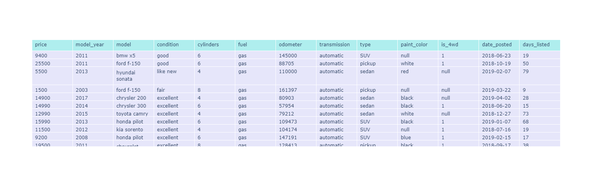

# EDA.ipynb  

full information include image is too big to be loading on the github it is compress form

you can find some images or run all again to see the images also I add the html file or open web app

Thank you for understanding.

<html './EDA.html'>
<html>

<body class="jp-Notebook" data-jp-theme-light="true" data-jp-theme-name="JupyterLab Light">

<h1 id="Sprint-4-Project">Sprint 4 Project<a class="anchor-link" href="#Sprint-4-Project">&#182;</a></h1><h2 id="Project-description">Project description<a class="anchor-link" href="#Project-description">&#182;</a></h2>
Develop a web application toa cloud service be acceble by public

<ul>
<li>load the code and result to github.com  (<a href="https://github.com/EspezuaMiguel/sprint4.git">https://github.com/EspezuaMiguel/sprint4.git</a>)</li>
<li>web application will display in render.com cloud  (<a href="https://test01-pbtt.onrender.com/">https://test01-pbtt.onrender.com/</a>)</li>
<li>the dataset will information come from car advertisemnt (vehicles_us.csv)</li>
<li>load the informatio, preprocessing and used plotly-express library for histogram and scattetplots.</li>
<li>generate the app.py script for deploy the chart on web app.</li>
</ul>

the project instruction are as folow 
Exploratory Data Analysis

<ol>
<li>Create an EDA.ipynb Jupyter notebook in VS Code.</li>
<li>Save the notebook in the notebooks directory of your project.</li>
<li>Perform some basic exploratory analysis of the dataset in the notebook.</li>
<li>Create a couple of histograms and scatterplots using plotly-express library.</li>
</ol>

Note:
if you are using the car advertisement dataset, it won’t be sufficient to

<ul>
<li>simply recreate the plots described in the blog post to complete the project. You’ll have to get creative and come up with your own plots and histograms.</li>
<li>it’s often very convenient to experiment with data visualizations in Jupyter, and then copy-paste code into a web application file later</li>
</ul>

Table Example

In&nbsp;[&nbsp;]:

     

<pre>import plotly.graph_objects as go
import numpy as np
import pandas as pd
import plotly.express as px

import re
</pre>

     

In&nbsp;[&nbsp;]:

     

<pre>df_vehicles = pd.read_csv(&#39;../vehicles_us.csv&#39;)
</pre>

     

In&nbsp;[&nbsp;]:

     

<pre>display(df_vehicles[:5])
df_vehicles.info()
</pre>

     

    
    

<table border="1" class="dataframe">
  <thead>
    <tr style="text-align: right;">
      <th></th>
      <th>price</th>
      <th>model_year</th>
      <th>model</th>
      <th>condition</th>
      <th>cylinders</th>
      <th>fuel</th>
      <th>odometer</th>
      <th>transmission</th>
      <th>type</th>
      <th>paint_color</th>
      <th>is_4wd</th>
      <th>date_posted</th>
      <th>days_listed</th>
    </tr>
  </thead>
  <tbody>
    <tr>
      <th>0</th>
      <td>9400</td>
      <td>2011.0</td>
      <td>bmw x5</td>
      <td>good</td>
      <td>6.0</td>
      <td>gas</td>
      <td>145000.0</td>
      <td>automatic</td>
      <td>SUV</td>
      <td>NaN</td>
      <td>1.0</td>
      <td>2018-06-23</td>
      <td>19</td>
    </tr>
    <tr>
      <th>1</th>
      <td>25500</td>
      <td>NaN</td>
      <td>ford f-150</td>
      <td>good</td>
      <td>6.0</td>
      <td>gas</td>
      <td>88705.0</td>
      <td>automatic</td>
      <td>pickup</td>
      <td>white</td>
      <td>1.0</td>
      <td>2018-10-19</td>
      <td>50</td>
    </tr>
    <tr>
      <th>2</th>
      <td>5500</td>
      <td>2013.0</td>
      <td>hyundai sonata</td>
      <td>like new</td>
      <td>4.0</td>
      <td>gas</td>
      <td>110000.0</td>
      <td>automatic</td>
      <td>sedan</td>
      <td>red</td>
      <td>NaN</td>
      <td>2019-02-07</td>
      <td>79</td>
    </tr>
    <tr>
      <th>3</th>
      <td>1500</td>
      <td>2003.0</td>
      <td>ford f-150</td>
      <td>fair</td>
      <td>8.0</td>
      <td>gas</td>
      <td>NaN</td>
      <td>automatic</td>
      <td>pickup</td>
      <td>NaN</td>
      <td>NaN</td>
      <td>2019-03-22</td>
      <td>9</td>
    </tr>
    <tr>
      <th>4</th>
      <td>14900</td>
      <td>2017.0</td>
      <td>chrysler 200</td>
      <td>excellent</td>
      <td>4.0</td>
      <td>gas</td>
      <td>80903.0</td>
      <td>automatic</td>
      <td>sedan</td>
      <td>black</td>
      <td>NaN</td>
      <td>2019-04-02</td>
      <td>28</td>
    </tr>
  </tbody>
</table>

    
    

<pre>&lt;class &#39;pandas.core.frame.DataFrame&#39;&gt;
RangeIndex: 51525 entries, 0 to 51524
Data columns (total 13 columns):
 #   Column        Non-Null Count  Dtype  
---  ------        --------------  -----  
 0   price         51525 non-null  int64  
 1   model_year    47906 non-null  float64
 2   model         51525 non-null  object 
 3   condition     51525 non-null  object 
 4   cylinders     46265 non-null  float64
 5   fuel          51525 non-null  object 
 6   odometer      43633 non-null  float64
 7   transmission  51525 non-null  object 
 8   type          51525 non-null  object 
 9   paint_color   42258 non-null  object 
 10  is_4wd        25572 non-null  float64
 11  date_posted   51525 non-null  object 
 12  days_listed   51525 non-null  int64  
dtypes: float64(4), int64(2), object(7)
memory usage: 5.1+ MB
</pre>

of total 51525 rows was read from dataset,  13 columns with information fro single vehicles posted. this record give the information of details for each vehicle, however some rows were no completed o miss inforamtion fro each columns.

In&nbsp;[&nbsp;]:

     

<pre>df_vehicles[&#39;model_year&#39;]=df_vehicles.groupby(&#39;model&#39;, group_keys=False)[&#39;model_year&#39;].apply(lambda x:x.fillna(x.median()))
</pre>

     

In&nbsp;[&nbsp;]:

     

<pre>df_vehicles[&#39;cylinders&#39;]=df_vehicles.groupby(&#39;model&#39;, group_keys=False)[&#39;cylinders&#39;].apply(lambda x:x.fillna(x.median()))
</pre>

     

In&nbsp;[&nbsp;]:

     

<pre>df_vehicles[&#39;odometer&#39;]=df_vehicles.groupby([&#39;model_year&#39;], group_keys=False)[&#39;odometer&#39;].apply(lambda x:x.fillna(x.median()))
</pre>

     

In&nbsp;[&nbsp;]:

     

<pre>&#39;&#39;&#39; Detection  outlier by price&#39;&#39;&#39;
# IQR
# Calculate the upper and lower limits
Q1 = df_vehicles[&#39;price&#39;].quantile(0.25)
Q3 = df_vehicles[&#39;price&#39;].quantile(0.75)
IQR = Q3 - Q1
lower = Q1 - 1.5*IQR
upper = Q3 + 1.5*IQR

# Create arrays of Boolean values indicating the outlier rows
upper_array = np.where(df_vehicles[&#39;price&#39;]&gt;=upper)[0]
lower_array = np.where(df_vehicles[&#39;price&#39;]&lt;=lower)[0]

# Removing the outliers
df_vehicles.drop(index=upper_array, inplace=True)
df_vehicles.drop(index=lower_array, inplace=True)
df_vehicles.reset_index(drop=True, inplace=True)
</pre>

     

In&nbsp;[&nbsp;]:

     

<pre>&#39;&#39;&#39; Detection &#39;&#39;&#39;
# IQR
# Calculate the upper and lower limits
Q1 = df_vehicles[&#39;model_year&#39;].quantile(0.25)
Q3 = df_vehicles[&#39;model_year&#39;].quantile(0.75)
IQR = Q3 - Q1
lower = Q1 - 1.5*IQR
upper = Q3 + 1.5*IQR

# Create arrays of Boolean values indicating the outlier rows
upper_array = np.where(df_vehicles[&#39;model_year&#39;]&gt;=upper)[0]
lower_array = np.where(df_vehicles[&#39;model_year&#39;]&lt;=lower)[0]

# Removing the outliers
df_vehicles.drop(index=upper_array, inplace=True)
df_vehicles.drop(index=lower_array, inplace=True)
df_vehicles.reset_index(drop=True, inplace=True)
</pre>

     

<h4 id="fill-in-the-missing-values">fill in the missing values<a class="anchor-link" href="#fill-in-the-missing-values">&#182;</a></h4><ul>
<li>model_year: group by model fill by median year (don4t drop rows with NaNs in this column)</li>
<li>cylindres: group by model fill by median cylindres</li>
<li>odometer: group by model year(or year+model) fill by median(mean)</li>
<li>odometer As a recommendation - it's better to remove model year and price outliers to make your scatterplots more informative.</li>
</ul>

In&nbsp;[&nbsp;]:

     

<pre>#Check drop values and fill nan
df_vehicles.info()
</pre>

     

    
    

<pre>&lt;class &#39;pandas.core.frame.DataFrame&#39;&gt;
RangeIndex: 49085 entries, 0 to 49084
Data columns (total 13 columns):
 #   Column        Non-Null Count  Dtype  
---  ------        --------------  -----  
 0   price         49085 non-null  int64  
 1   model_year    49085 non-null  float64
 2   model         49085 non-null  object 
 3   condition     49085 non-null  object 
 4   cylinders     49085 non-null  float64
 5   fuel          49085 non-null  object 
 6   odometer      49085 non-null  float64
 7   transmission  49085 non-null  object 
 8   type          49085 non-null  object 
 9   paint_color   40251 non-null  object 
 10  is_4wd        23875 non-null  float64
 11  date_posted   49085 non-null  object 
 12  days_listed   49085 non-null  int64  
dtypes: float64(4), int64(2), object(7)
memory usage: 4.9+ MB
</pre>

In&nbsp;[&nbsp;]:

     

<pre>fig = go.Figure(data=[go.Table(
    header=dict(values=list(df_vehicles.columns),
                fill_color=&#39;paleturquoise&#39;,
                align=&#39;left&#39;),
    cells=dict(values=df_vehicles.transpose().values.tolist(),
               fill_color=&#39;lavender&#39;,
               align=&#39;left&#39;))
])

fig.show()
</pre>

     

    
    

In&nbsp;[&nbsp;]:

     

<pre>df_vehicles[&#39;manufacturer&#39;]  =  df_vehicles[&#39;model&#39;].str.split(&#39; &#39;, n=1, expand=True)[0]
df_vehicles[&#39;manufacturer_count&#39;] = df_vehicles[&#39;manufacturer&#39;]
</pre>

     

split the column model, to add the column manufacturer in the dataframe

In&nbsp;[&nbsp;]:

     

<pre>display(df_vehicles.sample(10))
</pre>

     

    
    

<table border="1" class="dataframe">
  <thead>
    <tr style="text-align: right;">
      <th></th>
      <th>price</th>
      <th>model_year</th>
      <th>model</th>
      <th>condition</th>
      <th>cylinders</th>
      <th>fuel</th>
      <th>odometer</th>
      <th>transmission</th>
      <th>type</th>
      <th>paint_color</th>
      <th>is_4wd</th>
      <th>date_posted</th>
      <th>days_listed</th>
      <th>manufacturer</th>
      <th>manufacturer_count</th>
    </tr>
  </thead>
  <tbody>
    <tr>
      <th>34506</th>
      <td>3500</td>
      <td>2007.0</td>
      <td>chevrolet silverado 2500hd</td>
      <td>good</td>
      <td>8.0</td>
      <td>gas</td>
      <td>236000.0</td>
      <td>automatic</td>
      <td>pickup</td>
      <td>white</td>
      <td>NaN</td>
      <td>2019-02-01</td>
      <td>22</td>
      <td>chevrolet</td>
      <td>chevrolet</td>
    </tr>
    <tr>
      <th>39928</th>
      <td>5495</td>
      <td>2010.0</td>
      <td>volkswagen jetta</td>
      <td>excellent</td>
      <td>5.0</td>
      <td>gas</td>
      <td>53465.0</td>
      <td>automatic</td>
      <td>sedan</td>
      <td>black</td>
      <td>NaN</td>
      <td>2018-10-30</td>
      <td>71</td>
      <td>volkswagen</td>
      <td>volkswagen</td>
    </tr>
    <tr>
      <th>4140</th>
      <td>7000</td>
      <td>2010.0</td>
      <td>chevrolet silverado 2500hd</td>
      <td>good</td>
      <td>8.0</td>
      <td>gas</td>
      <td>128000.0</td>
      <td>automatic</td>
      <td>pickup</td>
      <td>green</td>
      <td>1.0</td>
      <td>2019-01-04</td>
      <td>58</td>
      <td>chevrolet</td>
      <td>chevrolet</td>
    </tr>
    <tr>
      <th>40333</th>
      <td>7950</td>
      <td>2010.0</td>
      <td>honda accord</td>
      <td>excellent</td>
      <td>4.0</td>
      <td>gas</td>
      <td>121607.0</td>
      <td>automatic</td>
      <td>sedan</td>
      <td>black</td>
      <td>NaN</td>
      <td>2018-06-29</td>
      <td>36</td>
      <td>honda</td>
      <td>honda</td>
    </tr>
    <tr>
      <th>24154</th>
      <td>4950</td>
      <td>2009.0</td>
      <td>honda cr-v</td>
      <td>good</td>
      <td>4.0</td>
      <td>gas</td>
      <td>131565.0</td>
      <td>automatic</td>
      <td>SUV</td>
      <td>blue</td>
      <td>NaN</td>
      <td>2018-11-30</td>
      <td>6</td>
      <td>honda</td>
      <td>honda</td>
    </tr>
    <tr>
      <th>44037</th>
      <td>1700</td>
      <td>2003.0</td>
      <td>ford explorer</td>
      <td>good</td>
      <td>6.0</td>
      <td>gas</td>
      <td>210000.0</td>
      <td>automatic</td>
      <td>SUV</td>
      <td>silver</td>
      <td>1.0</td>
      <td>2018-12-12</td>
      <td>11</td>
      <td>ford</td>
      <td>ford</td>
    </tr>
    <tr>
      <th>25741</th>
      <td>13000</td>
      <td>2010.0</td>
      <td>toyota tacoma</td>
      <td>excellent</td>
      <td>6.0</td>
      <td>gas</td>
      <td>150000.0</td>
      <td>automatic</td>
      <td>pickup</td>
      <td>silver</td>
      <td>1.0</td>
      <td>2018-12-13</td>
      <td>8</td>
      <td>toyota</td>
      <td>toyota</td>
    </tr>
    <tr>
      <th>13450</th>
      <td>14498</td>
      <td>2014.0</td>
      <td>acura tl</td>
      <td>excellent</td>
      <td>6.0</td>
      <td>gas</td>
      <td>84152.0</td>
      <td>automatic</td>
      <td>sedan</td>
      <td>black</td>
      <td>NaN</td>
      <td>2018-12-14</td>
      <td>38</td>
      <td>acura</td>
      <td>acura</td>
    </tr>
    <tr>
      <th>19441</th>
      <td>3900</td>
      <td>2004.0</td>
      <td>honda accord</td>
      <td>fair</td>
      <td>4.0</td>
      <td>gas</td>
      <td>156640.0</td>
      <td>automatic</td>
      <td>sedan</td>
      <td>silver</td>
      <td>NaN</td>
      <td>2018-12-02</td>
      <td>87</td>
      <td>honda</td>
      <td>honda</td>
    </tr>
    <tr>
      <th>38636</th>
      <td>24500</td>
      <td>2017.0</td>
      <td>gmc sierra 1500</td>
      <td>like new</td>
      <td>8.0</td>
      <td>gas</td>
      <td>18000.0</td>
      <td>automatic</td>
      <td>truck</td>
      <td>NaN</td>
      <td>NaN</td>
      <td>2018-11-30</td>
      <td>27</td>
      <td>gmc</td>
      <td>gmc</td>
    </tr>
  </tbody>
</table>

In&nbsp;[&nbsp;]:

     

<pre>count_vehicles = df_vehicles.groupby([&#39;type&#39;,&#39;manufacturer&#39;], as_index=False)[&#39;manufacturer_count&#39;].count()
</pre>

     

In&nbsp;[&nbsp;]:

     

<pre>df = px.data.medals_long()

fig = px.bar(count_vehicles, x=&quot;manufacturer&quot;, y=&quot;manufacturer_count&quot;, color=&quot;type&quot;, title=&#39;Number vehicles by manufacture&#39;)
fig.show()
</pre>

     

    
    

In&nbsp;[&nbsp;]:

     

<pre>df_vehicles[&#39;condition_count&#39;] = df_vehicles[&#39;condition&#39;]
count_conditions = df_vehicles.groupby([&#39;condition&#39;,&#39;model_year&#39;], as_index=False)[&#39;condition_count&#39;].count()
</pre>

     

In&nbsp;[&nbsp;]:

     

<pre>fig = px.histogram(count_conditions, x=&quot;model_year&quot;, y=&quot;condition_count&quot;, color=&quot;condition&quot;, nbins=30, title=&#39;Histogram - comparison by vehicles condition&#39;)
fig.show()
</pre>

     

    
    

In&nbsp;[&nbsp;]:

     

<pre>manufacture_comparison = df_vehicles.groupby([&#39;manufacturer&#39;], as_index=False)[&#39;manufacturer_count&#39;].count()

price_manufacture = df_vehicles[[&#39;price&#39;, &#39;manufacturer&#39;]].copy()
</pre>

     

In&nbsp;[&nbsp;]:

     

<pre>price_manufacturetwo = price_manufacture[(price_manufacture[&#39;manufacturer&#39;] ==  &#39;bmw&#39;) | (price_manufacture[&#39;manufacturer&#39;] ==  &#39;toyota&#39;)]
</pre>

     

    
    

<table border="1" class="dataframe">
  <thead>
    <tr style="text-align: right;">
      <th></th>
      <th>price</th>
      <th>manufacturer</th>
    </tr>
  </thead>
  <tbody>
    <tr>
      <th>0</th>
      <td>9400</td>
      <td>bmw</td>
    </tr>
    <tr>
      <th>6</th>
      <td>12990</td>
      <td>toyota</td>
    </tr>
    <tr>
      <th>21</th>
      <td>5250</td>
      <td>toyota</td>
    </tr>
    <tr>
      <th>31</th>
      <td>11999</td>
      <td>toyota</td>
    </tr>
  </tbody>
</table>

In&nbsp;[&nbsp;]:

     

<pre># create figure
x_1 = price_manufacture[price_manufacture[&#39;manufacturer&#39;] ==  &#39;bmw&#39;][&#39;price&#39;]
fig = go.Figure()

fig.add_trace(go.Histogram(histfunc=&quot;avg&quot;,
                           x=x_1,
                           name=&quot;bmw&quot;,nbinsx = 50)
             )

#Create a button list for the colors
buttonlist1 = []
for p1 in price_manufacture[&#39;manufacturer&#39;].unique():
      x_11 = price_manufacture[price_manufacture[&#39;manufacturer&#39;] == p1][&#39;price&#39;]
      #print(x_11)
      #print(p1, str(p1))
      buttonlist1.append(
        dict(
           # args=[{&#39;name&#39;: str(p1) ,&#39;x&#39;:&#39;x_11&#39;}],
            args=[{&#39;x&#39;:[x_11],&#39;name&#39;:[str(p1)]}],
            #args=[&#39;name&#39;, str(p1)],
            label= str(p1),
            method=&#39;restyle&#39;
            ))

#Update the layout to include the dropdown menus, and to show titles etc

updatemenus = list([
    dict(buttons=buttonlist1,
    )
])

# Add dropdown
fig.update_layout(title_text=&#39;Histogram by singles factory&#39;)
fig.update_layout(
    updatemenus=updatemenus)
fig.update_layout(barmode=&#39;overlay&#39;)
fig.show()
</pre>

     

    
    

In&nbsp;[&nbsp;]:

     

<pre>maxlen=[]
for p2 in price_manufacture[&#39;manufacturer&#39;].unique():
      maxlen.append(len(price_manufacture[price_manufacture[&#39;manufacturer&#39;] == p2][&#39;price&#39;]))

maxros =  max(maxlen)
#new_index = pd.Index(range(maxros+1))
print(max(maxlen))

dfm = pd.DataFrame(index=range(maxros))
for p2 in price_manufacture[&#39;manufacturer&#39;].unique():
      colupd = price_manufacture[price_manufacture[&#39;manufacturer&#39;] == p2][&#39;price&#39;].reset_index(drop=True)

      collen = len(price_manufacture[price_manufacture[&#39;manufacturer&#39;] == p2][&#39;price&#39;])

      dfm[p2] = colupd
</pre>

     

    
    

<pre>12069
</pre>

In&nbsp;[&nbsp;]:

     

<pre># create a figure with two place holder traces
fig = go.Figure(
    [
        go.Histogram(histfunc=&quot;avg&quot;,x=dfm[dfm.columns[i]], meta=i, name=i, nbinsx = 50, opacity=0.6, histnorm=&#39;probability density&#39;)
        for i in range(2)
    ]
)

# but data for y and name in when country is selected
fig.update_layout(title_text=&#39;Normalized Histogram - Price comparison between two make vehicles&#39;)
fig.update_layout(
    updatemenus=[
        {
            &quot;x&quot;: b / 3,
            &quot;y&quot;: 1.4,
            &quot;active&quot;: None,
            &quot;buttons&quot;: [
                {
                    &quot;label&quot;: c,
                    &quot;method&quot;: &quot;restyle&quot;,
                    &quot;args&quot;: [{&quot;x&quot;: [dfm[c]], &quot;name&quot;: c}, [b]],
                }
                for c in dfm.columns
            ],
        }
        for b in range(2)
    ]
)
fig.update_layout(barmode=&#39;overlay&#39;)
</pre>

     

    
    

In&nbsp;[&nbsp;]:

     

<pre># create a figure with two place holder traces
fig = go.Figure(
    [
        go.Histogram(histfunc=&quot;avg&quot;,x=dfm[dfm.columns[i]], meta=i, name=i, nbinsx = 50, opacity=0.6)
        for i in range(2)
    ]
)

# but data for y and name in when country is selected
fig.update_layout(title_text=&#39;Histogram - Price comparison between two make vehicles&#39;)
fig.update_layout(
    updatemenus=[
        {
            &quot;x&quot;: b / 3,
            &quot;y&quot;: 1.4,
            &quot;active&quot;: None,
            &quot;buttons&quot;: [
                {
                    &quot;label&quot;: c,
                    &quot;method&quot;: &quot;restyle&quot;,
                    &quot;args&quot;: [{&quot;x&quot;: [dfm[c]], &quot;name&quot;: c}, [b]],
                }
                for c in dfm.columns
            ],
        }
        for b in range(2)
    ]
)
fig.update_layout(barmode=&#39;overlay&#39;)
</pre>

     

    
    

<h2 id="Conclusion:">Conclusion:<a class="anchor-link" href="#Conclusion:">&#182;</a></h2><ul>
<li>
on the preprocessing stage we fill the nan cells with media values calculated with semilar items by grouping.  for whe next columns 'model_year', 'cylinders', 'odometer'.

</li>
<li>
were drop the outler values for price and model year, were calculated the values outsite of interquartil ranges.

</li>
<li>
in order to get manufacture information were extract from model column.

</li>
</ul>

overoll, the dataset provide valious information acording volumen comparison of vehicles are avibles on the market. the condition of vehicles. 
the last chart help to undertand the distribution of price by comparing two branch.

</body>

</html>
